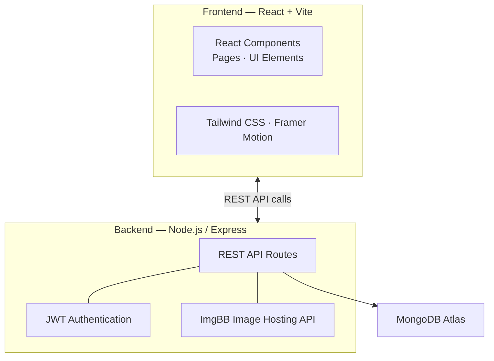

<p align="center">
  
</p>
<h1 align="center">Sahara Homestay: Premium Living Reimagined</h1>
<p align="center">
  <strong>A modern, dynamic MERN stack platform for premium homestay management</strong><br/>
  <em>Responsive UI → Dynamic CMS → Admin Dashboard → Instant Booking via WhatsApp</em>
</p>

<p align="center">
  
  
  
  
  
  
</p>

---

## 📋 Table of Contents

- [Overview](#-overview)
- [Key Features](#-key-features)
- [Architecture](#-architecture)
- [Tech Stack](#-tech-stack)
- [Quick Start](#-quick-start)
- [Admin Panel](#-admin-panel)
- [Project Structure](#-project-structure)
- [Contact](#-contact)

---

## 🔍 Overview

**Sahara Homestay** is a high-end, full-stack web application designed for student and professional accommodation management. Unlike static websites, Sahara features a robust **Dynamic CMS** that allows administrators to update room details, gallery images, testimonials, and contact information in real-time without touching a single line of code.

The platform prioritizes visual excellence with a modern "Glassmorphism" aesthetic, smooth animations, and a user-centric booking flow integrated with WhatsApp.

---

## ✨ Key Features

### 🖥️ Dynamic Frontend
| Feature | Description |
|---|---|
| **Responsive Design** | Optimized for mobile, tablet, and desktop viewing. |
| **Hero Section** | Dual-column layout with top-aligned text and vertical rolling testimonials. |
| **Dynamic Rooms** | Admin-configurable grid layouts for room listings. |
| **Testimonial Engine** | Rolling reviews with profile images and fallback initial badges. |
| **WhatsApp Booking** | Instant lead generation via pre-filled WhatsApp messages. |
| **Our Clients Strip** | Sticky bottom infinite scrolling partner strip presenting logos and company names seamlessly, integrated with global mobile responsiveness and copyright notice. |

### 🛠️ Powerful Admin Dashboard
| Feature | Description |
|---|---|
| **Mobile-First UI** | Fully responsive admin console for on-the-go management. |
| **Live CMS** | Update Hero text, Subtitles, and Contact info on the fly. |
| **Gallery Manager** | Drag-and-drop image uploads with automatic ImgBB integration. |
| **Room Management** | Add/Edit rooms with dual pricing (Cooler vs. AC), sharing types, and location support. |
| **Booking System** | View and manage guest bookings with one-click Confirm/Cancel actions. |
| **Client Strip Manager** | Add, edit, and delete partner clients/logos. Supports direct file uploads with ImgBB integration. |
| **Admin Settings** | Securely update admin username and password from the dashboard. |
| **Message Center** | Dedicated inbox for contact form submissions. |
| **Global Config** | Change site-wide settings like room/gallery column counts from the UI. |

---

## 🏗 Architecture



<details>
<summary>ASCII fallback (click to expand)</summary>

```
┌─────────────────────────────────────────────────────────────────┐
│                    Sahara Homestay Platform                     │
│                                                                 │
│  ┌───────────────┐    ┌──────────────────────────────────────┐  │
│  │   Frontend    │    │          Backend (Node/Express)      │  │
│  │   (React)     │    │                                      │  │
│  │               │    │  ┌────────────┐  ┌────────────────┐  │  │
│  │ Vite + React  │◄──►│  │ API Routes │  │ Authentication │  │  │
│  │ Tailwind CSS  │    │  │ (REST)     │  │ (JWT)          │  │  │
│  │ Framer Motion │    │  └─────┬──────┘  └────────────────┘  │  │
│  └───────────────┘    │        │         ┌───────────────┐   │  │
│                       │  ┌─────▼──────┐  │ Image Hosting │   │  │
│                       │  │   MongoDB  │  │ (ImgBB API)   │   │  │
│                       │  │   Atlas    │  └───────────────┘   │  │
│                       │  └────────────┘                      │  │
│                       └──────────────────────────────────────┘  │
└─────────────────────────────────────────────────────────────────┘
```

</details>

---

## 🚀 Quick Start

### 1. Clone & Install
```bash
git clone https://github.com/Felix-au/Sahara-Homestay-Client-Website.git
cd Sahara-Homestay-Client-Website

# Install Server Dependencies
cd server && npm install

# Install Client Dependencies
cd ../client && npm install
```

### 2. Environment Setup

**Backend Setup:**
Create a `.env` file in the `/server` directory:
```env
PORT=5000
MONGO_URI=your_mongodb_uri
JWT_SECRET=your_secret
ADMIN_USER=admin
ADMIN_PASS=admin123
SERPAPI_API_KEY=your_serpapi_api_key
```

**Frontend Setup:**
Create a `.env` file in the `/client` directory:
```env
VITE_API_BASE_URL=http://localhost:5000/api
```

### 3. Run Development

```bash
# In /server
npm start

# In /client
npm run dev
```

---

## 📦 Project Structure

```
sahara/
├── client/              # React Frontend (Vite)
│   ├── src/
│   │   ├── components/  # Reusable UI components (Footer, AdminNavbar, RoomCard)
│   │   ├── pages/       # Page components (Home, AdminDashboard, AdminLogin)
│   │   └── index.css    # Global styles, infinite scroll keyframes & sticky footer configurations
│   └── public/          # Static assets
├── server/              # Node.js Backend
│   ├── models/          # Mongoose Schemas (Room, Content, Message, Client)
│   ├── routes/          # API Endpoints (rooms, content, messages, admin, clients)
│   ├── config/          # DB connection & Seeder
│   └── server.js        # Server entry point registering routing middleware
├── README.md            # You are here
├── guide.md             # Detailed setup guide
└── Sahara-Homestay.md   # Deep dive technical documentation
```

---

## 👤 Author

**Felix-au**

- 🔗 GitHub: [github.com/Felix-au](https://github.com/Felix-au)
- 📧 Email: [felixaugum@gmail.com](mailto:felixaugum@gmail.com)

---

<p align="center">
  <sub>Built for comfort. Designed for Sahara.</sub>
</p>
